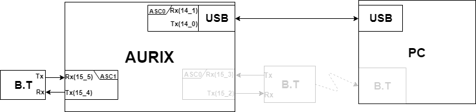

# Connect AURIX to PC with BlueTooth

## Objectives

- AURIX를 이용한 블루투스 모듈의 BaudRate 변경
- 블루투스 모듈을 이용한 무선 통신

## References

- Hello world
- My own terminals
- iLLD_1_0_1_4_0-Files/File_List/IfxAsclin_Asc.c
- HC-06(data sheet)

**[Example Code]**

- MyIlldModule_TC23A - AsclinAsc
- InfineonRacer_TC23A


## Backgorung 정보

- **BlueTooth**
  - HC-06은 3.1 V ~ 4.2 V에서 동작한다. TC237의 출력 전압은 3.3 V로 충분히 사용 가능하다.

  - Rx / Tx 는 Receive, Transmit의 약어로 HC-06과 TC237의 핀이 엇갈리게 연결되어야 한다.

- **AT Command**

  - HC-06의 Default Baud Rate는 9600이고, TC237의 Default Baud rate는 115200이다.
  - 원활한 통신을 위해서는 두 장치의 Baud rate를 통일시켜주어야 한다.
  - HC-06의 Baud rate를 변경하기 위해서는 AT Command를 사용해야 한다.


## 1. Change bluetooth Baudrate

- MyIlldModule_TC23A - AsclinAsc 코드를 변형해서 사용
- 블루투스 모듈인 **HC-06**의 baudrate를 9600(default value)에서 115200으로 변경
  - 터미널을 통해 AURIX board에 명령
  - AURIX board에서 받은 명령을 HC-06으로 전달


### Code Description

- 터미널을 통해 다음의 기능이 동작하는지 확인한다.
  - 터미널을 통해  "AT"라는 문자를 입력한다
  - Shell에 "OK"라는 문자가 출력되는지 확인한다.
  - AT command를 통해 baudrate를 변경한다.


### Hardware Connection

- Pin 연결

  - USB케이블은 AURIX 보드의 pin(P14.0, 14.1)와 연결된다.
  - BlueToothe 모듈은  AURIX 보드의 pin(P15.4, 15.5)와 연결된다.




### iLLD - realated

#### Module Configuration

- Asclin의 모듈 초기화

  - Asc0과 Asc1을 설정 
  - 송수신이 일어날 물리적 pin(P14.0, 14.1), pin(P15.4, 15.5)을 고르고.
  - Data 전송 속도를 정한 뒤, (AURIX와 통신을 진행하는 기기와 동일하게 맞춤)
  - 통신관련 Interrupt 설정

  ```c
  
  void AsclinAscDemo_init(void)
  {
      //............
  {
      //....Asc0 module configuration
  }
  {//Asc1 module configuration
  		/* disable interrupts */
      	boolean              interruptState = IfxCpu_disableInterrupts();
      
  	 	/* create module config */
          IfxAsclin_Asc_Config ascConfig;
          IfxAsclin_Asc_initModuleConfig(&ascConfig, &MODULE_ASCLIN1);
  
          /* set the desired baudrate */
          ascConfig.baudrate.prescaler    = 1;
          ascConfig.baudrate.baudrate     = 115200; /* FDR values will be calculated in initModule */
          ascConfig.baudrate.oversampling = IfxAsclin_OversamplingFactor_4;
  
          /* ISR priorities and interrupt target */
          ascConfig.interrupt.txPriority    = ISR_PRIORITY_ASC_1_TX;
          ascConfig.interrupt.rxPriority    = ISR_PRIORITY_ASC_1_RX;
          ascConfig.interrupt.erPriority    = ISR_PRIORITY_ASC_1_EX;
          ascConfig.interrupt.typeOfService = (IfxSrc_Tos)IfxCpu_getCoreIndex();
  
          /* FIFO configuration */
          ascConfig.txBuffer     = g_AsclinAsc1.ascBuffer.tx;
          ascConfig.txBufferSize = ASC_TX_BUFFER_SIZE;
  
          ascConfig.rxBuffer     = g_AsclinAsc1.ascBuffer.rx;
          ascConfig.rxBufferSize = ASC_RX_BUFFER_SIZE;
  
          /* pin configuration */
          const IfxAsclin_Asc_Pins pins = {
              NULL_PTR,IfxPort_InputMode_pullUp,        /* CTS pin not used */
              &IfxAsclin1_RXB_P15_5_IN, IfxPort_InputMode_pullUp,        /* Rx pin */
              NULL_PTR,IfxPort_OutputMode_pushPull,     /* RTS pin not used */
              &IfxAsclin1_TX_P15_4_OUT, IfxPort_OutputMode_pushPull,     /* Tx pin */
              IfxPort_PadDriver_cmosAutomotiveSpeed1
          };
          ascConfig.pins = &pins;
  
          /* initialize module */
          IfxAsclin_Asc_initModule(&g_AsclinAsc1.drivers.asc, &ascConfig);
  
          /* enable interrupts again */
          IfxCpu_restoreInterrupts(interruptState);
  
  }
  }
  ```


#### Interrupt Configuration

- 통신 간 데이터 송수신을 위한 인터럽트를 등록한다.

```c
//in ConfigurationIsr.h
//set interrupt priority
#define ISR_PRIORITY_ASC_0_RX 4  
#define ISR_PRIORITY_ASC_0_TX 5 
#define ISR_PRIORITY_ASC_0_EX 6 

#define ISR_PRIORITY_ASC_1_RX 7 
#define ISR_PRIORITY_ASC_1_TX 8 
#define ISR_PRIORITY_ASC_1_EX 9

//name Interrupt serivce provider configuration
#define ISR_PROVIDER_ASC_0    IfxSrc_Tos_cpu0 
#define ISR_PROVIDER_ASC_1    IfxSrc_Tos_cpu0 

//name Interrupt configuration
#define INTERRUPT_ASC_0_RX    ISR_ASSIGN(ISR_PRIORITY_ASC_0_RX, ISR_PROVIDER_ASC_0) 
#define INTERRUPT_ASC_0_TX    ISR_ASSIGN(ISR_PRIORITY_ASC_0_TX, ISR_PROVIDER_ASC_0) 
#define INTERRUPT_ASC_0_EX    ISR_ASSIGN(ISR_PRIORITY_ASC_0_EX, ISR_PROVIDER_ASC_0)

#define INTERRUPT_ASC_1_RX    ISR_ASSIGN(ISR_PRIORITY_ASC_1_RX, ISR_PROVIDER_ASC_1)
#define INTERRUPT_ASC_1_TX    ISR_ASSIGN(ISR_PRIORITY_ASC_1_TX, ISR_PROVIDER_ASC_1)
#define INTERRUPT_ASC_1_EX    ISR_ASSIGN(ISR_PRIORITY_ASC_1_EX, ISR_PROVIDER_ASC_1)

// in AsclinAscDemo.c
IFX_INTERRUPT(asclin0TxISR, 0, ISR_PRIORITY_ASC_0_TX);
IFX_INTERRUPT(asclin0RxISR, 0, ISR_PRIORITY_ASC_0_RX);
IFX_INTERRUPT(asclin0ErISR, 0, ISR_PRIORITY_ASC_0_EX);

IFX_INTERRUPT(asclin1TxISR, 0, ISR_PRIORITY_ASC_1_TX);
IFX_INTERRUPT(asclin1RxISR, 0, ISR_PRIORITY_ASC_1_RX);
IFX_INTERRUPT(asclin1ErISR, 0, ISR_PRIORITY_ASC_1_EX);

//name Interrupt for Transmit
void asclin0TxISR(void)
{
    IfxAsclin_Asc_isrTransmit(&g_AsclinAsc0.drivers.asc);
}
void asclin1TxISR(void)
{
    IfxAsclin_Asc_isrTransmit(&g_AsclinAsc1.drivers.asc);
}

//name Interrupt for Receive
void asclin0RxISR(void)
{
    IfxAsclin_Asc_isrReceive(&g_AsclinAsc0.drivers.asc);
}
void asclin1RxISR(void)
{
    IfxAsclin_Asc_isrReceive(&g_AsclinAsc1.drivers.asc);
}

//name Interrupt for Error
void asclin0ErISR(void)
{
    IfxAsclin_Asc_isrError(&g_AsclinAsc0.drivers.asc);
}
void asclin1ErISR(void)
{
    IfxAsclin_Asc_isrError(&g_AsclinAsc1.drivers.asc);
}

```


#### Module Behavior

- AT command를 사용하기 위해 함수를 구성
  - ``IfxAsclin_Asc_getReadCount`` :  buffer에 입력된 데이터의 바이트 수를 리턴
  - ```IfxAsclin_Asc_read```  : 버퍼의 데이터를 읽고 지정한  변수에 데이터를 저장
  - ```IfxAsclin_Asc_write``` : 변수에 있는 데이터를 출력

```c
// in AsclinAscDemo.c
void AsclinAscDemo_run(void)
{ 
	g_AscWord.EndLineCount = 2;
	g_AscWord.SpaceCount = 2;

    sint8 Word_EndLine[2] = ENDL;
    sint8 Word_Space[2] = " \b"; 
    
    static Ifx_SizeT  index = 0;

    //Get the number of bytes in the rx buffer 
	g_AsclinAsc0.count = IfxAsclin_Asc_getReadCount(&g_AsclinAsc0.drivers.asc);


	if(g_AsclinAsc0.count != 0){
        //If the data was in buffer read the data and Write it to the Shell

        IfxAsclin_Asc_read(&g_AsclinAsc0.drivers.asc, &g_AsclinAsc0.rxData,g_AsclinAsc0.count, TIME_NULL);
    IfxAsclin_Asc_write(&g_AsclinAsc0.drivers.asc, g_AsclinAsc0.rxData, &g_AsclinAsc0.count, TIME_NULL);

    if(g_AsclinAsc0.rxData[0] == '\r'){
        //If AURIX board receive '\r' then it send "\r\n" to the Shell

       	IfxAsclin_Asc_write(&g_AsclinAsc0.drivers.asc, g_AsclinAsc0.txData, &index, TIME_NULL);
        IfxAsclin_Asc_write(&g_AsclinAsc0.drivers.asc, Word_EndLine, &g_AscWord.EndLineCount, TIME_NULL);

        IfxAsclin_Asc_write(&g_AsclinAsc1.drivers.asc, g_AsclinAsc0.txData, &index, TIME_NULL);
        index = 0;

       }
     else if(g_AsclinAsc0.rxData[0] == '\b'){//If AURIX board receive '\r' then it send '(space)' to the Shell
        	index--;
        	IfxAsclin_Asc_write(&g_AsclinAsc0.drivers.asc, Word_Space, &g_AscWord.SpaceCount , TIME_NULL);
        	if(index < 0) index = 0;
      }
      else
        {
        	g_AsclinAsc0.txData[index] = g_AsclinAsc0.rxData[0];
        	index = index + g_AsclinAsc0.count;
        	if(index >= 20) index = 0;
        }

	}

    g_AsclinAsc1.count = IfxAsclin_Asc_getReadCount(&g_AsclinAsc1.drivers.asc);

    if(g_AsclinAsc1.count != 0){
	IfxAsclin_Asc_read(&g_AsclinAsc1.drivers.asc, g_AsclinAsc1.rxData, &g_AsclinAsc1.count, TIME_NULL);
	IfxAsclin_Asc_write(&g_AsclinAsc0.drivers.asc, g_AsclinAsc1.rxData, &g_AsclinAsc1.count, TIME_NULL);
    }


}
```

###HC-06 related

- AT command mode 
  -  HC-06의 설정을 바꿀수 있는 상태
  - 연결 확인, Board rate 변경,  Bluetoothe 이름 변경, Bluetooth 패스워드 변경 등이 가능하다.
- Way to the AT command mode
  - 모듈에 파워 공급시 AT command mode로 진입한다.
  - 페어링 할 시 AT command  mode가 중단된다.


###추가적인 설명

##2. Connect BlueTooth and AURIX

- InfineonRacer_TC23A 코드를 변형하여 사용
  - 송수신이 일어날 물리적 pin(P14.0, 14.1)에서 pin(P15.2, 15.3)으로 변경

### Hardware connnection

- Pin 연결

  - BlueToothe 모듈은  AURIX 보드의 pin(P15.2, 15.3)와 연결된다.


### iLLD related

- Module Configuration
  - 블루투스 통신을 위해 RxD / TxD Line을 P15.3 / P15.2로 변경.

```c
//in AsclinShellInterface.c
void initSerialInterface(void)
{
    {   //........
        
        IfxAsclin_Asc_Pins ascPins = {
            .cts       = NULL_PTR,
            .ctsMode   = IfxPort_InputMode_noPullDevice,
            .rx        = &IfxAsclin0_RXB_P15_3_IN,
            .rxMode    = IfxPort_InputMode_noPullDevice,
            .rts       = NULL_PTR,
            .rtsMode   = IfxPort_OutputMode_pushPull,
            .tx        = &IfxAsclin0_TX_P15_2_OUT,
            .txMode    = IfxPort_OutputMode_pushPull,
            .pinDriver = IfxPort_PadDriver_cmosAutomotiveSpeed1
        };
       
        //........
    }

  //......
}
```


###추가적인 설명

Terminal을 통한 송수신 확인

1.  Teraterm을 실행하여 board에 연결된 HC-06과 연결.


2. 설정 - 시리얼포트 설정에서 Baud rate를 115200으로 변경.


3.  Enter를 입력하면 아래와 같은 화면이 된다.


4. help명령어 입력 시 아래와 같다.

