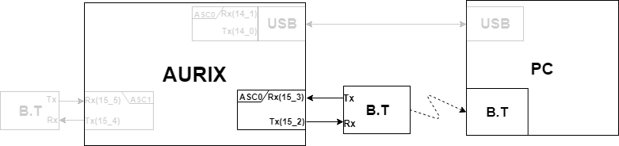

# Connect AURIX to PC with Bluetooth

## Objectives

- AURIX를 이용한 블루투스 모듈(HC-06) 설정
- InfineonRacer에서 유선 직렬 통신을 무선(Bluetooth) 직렬 통신으로 변경하여 활용하기

## References

- Hello world
- My own terminals
- iLLD_1_0_1_4_0-Files/File_List/IfxAsclin_Asc.c
- HC-06 data sheet

**[Example Code]**

- MyIlldModule_TC23A - AsclinAsc
- MyIlldModule_TC23A - AsclinAscBtCfg
- InfineonRacer_TC23A


## Background Information

- **Bluetooth**
  - HC-06은 3.1 V ~ 4.2 V에서 동작한다. AURIX의 출력 전압은 3.3 V로 충분히 사용 가능하다.
  - Rx / Tx 는 Receive, Transmit의 약어로 HC-06과 AURIX의 Rx,Tx가 교차하도록 연결해야 한다.
  - HC-06 baud rate의 기본값은 9600이고 통신을 하기 위해서는 AURIX의 baud rate와 일치해야한다.

## 1. Change Bluetooth baud rate
###Objectives

- 터미널을 통해 다음의 기능이 동작하는지 확인한다.
  - 터미널을 통해  "AT"라는 문자를 입력한다.
  - Shell에 "OK"라는 문자가 출력되는지 확인한다.
- AT command를 통해 baud rate를 변경한다.
  - 터미널을 통해 AURIX에 명령 송신
  - HC-06의 baud rate를 9600에서 115200으로 변경
  - AURIX에서 받은 명령을 HC-06으로 전달
###Example code
- MyIlldModule_TC23A - AsclinAscBtCfg

### Hardware Connection

- Pin 연결

  - AURIX의 USB는 pin(P14.0, P14.1)로 설정되어 있다.
  - HC-06은 AURIX의 pin(P15.4, P15.5)와 연결된다.


### iLLD - realated

#### Module Configuration

- Asclin의 모듈 초기화

  - Asc1을 추가로 설정한다.
  - 아래와 같이 ASC_0과 관련된 부분을 ASC_1로 변경해준다.
```c
          ascConfig.interrupt.txPriority    = ISR_PRIORITY_ASC_1_TX;
          ascConfig.interrupt.rxPriority    = ISR_PRIORITY_ASC_1_RX;
          ascConfig.interrupt.erPriority    = ISR_PRIORITY_ASC_1_EX;
```
  - 송수신이 일어날 물리적 pin(P15.4, P15.5)을 설정
```c
const IfxAsclin_Asc_Pins pins = {
              NULL_PTR,IfxPort_InputMode_pullUp,        /* CTS pin not used */
              &IfxAsclin1_RXB_P15_5_IN, IfxPort_InputMode_pullUp,  /* Rx pin */
              NULL_PTR,IfxPort_OutputMode_pushPull,     /* RTS pin not used */
              &IfxAsclin1_TX_P15_4_OUT, IfxPort_OutputMode_pushPull,/* Tx pin*/
              IfxPort_PadDriver_cmosAutomotiveSpeed1
          };
```
  - HC-06 baud rate의 기본값은 9600으로 AURIX의 baud rate도 9600으로 맞추어 준다.
```c
	ascConfig.baudrate.baudrate     = 9600; /* FDR values will be calculated in initModule */
```
#### Interrupt Configuration

- 통신 간 데이터 송수신을 위한 인터럽트를 등록한다.

```c
//in ConfigurationIsr.h
//set interrupt priority
#define ISR_PRIORITY_ASC_1_RX 7 
#define ISR_PRIORITY_ASC_1_TX 8 
#define ISR_PRIORITY_ASC_1_EX 9

//name Interrupt serivce provider configuration
#define ISR_PROVIDER_ASC_1    IfxSrc_Tos_cpu0 

//name Interrupt configuration
#define INTERRUPT_ASC_1_RX    ISR_ASSIGN(ISR_PRIORITY_ASC_1_RX, ISR_PROVIDER_ASC_1)
#define INTERRUPT_ASC_1_TX    ISR_ASSIGN(ISR_PRIORITY_ASC_1_TX, ISR_PROVIDER_ASC_1)
#define INTERRUPT_ASC_1_EX    ISR_ASSIGN(ISR_PRIORITY_ASC_1_EX, ISR_PROVIDER_ASC_1)

// in AsclinAscDemo.c
IFX_INTERRUPT(asclin1TxISR, 0, ISR_PRIORITY_ASC_1_TX);
IFX_INTERRUPT(asclin1RxISR, 0, ISR_PRIORITY_ASC_1_RX);
IFX_INTERRUPT(asclin1ErISR, 0, ISR_PRIORITY_ASC_1_EX);

//name Interrupt for Transmit
void asclin1TxISR(void)
{
    IfxAsclin_Asc_isrTransmit(&g_AsclinAsc1.drivers.asc);
}

//name Interrupt for Receive
void asclin1RxISR(void)
{
    IfxAsclin_Asc_isrReceive(&g_AsclinAsc1.drivers.asc);
}

//name Interrupt for Error
void asclin1ErISR(void)
{
    IfxAsclin_Asc_isrError(&g_AsclinAsc1.drivers.asc);
}

```


#### Module Behavior

- Asclin_Asc function description
  - ``IfxAsclin_Asc_getReadCount`` :  buffer에 입력된 데이터의 바이트 수를 리턴
  - ```IfxAsclin_Asc_read```  : buffer의 데이터를 읽고 지정한 변수에 데이터를 저장
  - ```IfxAsclin_Asc_write``` : 변수에 있는 데이터를 출력

```c
// in AsclinAscDemo.c
void AsclinAscDemo_run(void)
{ 
	g_AscWord.EndLineCount = 2; //Insert new line
	g_AscWord.SpaceCount = 2;   //Delete letter

    sint8 Word_EndLine[2] = ENDL;
    sint8 Word_Space[2] = " \b"; 
    
    static Ifx_SizeT  index = 0;

    //Get the number of bytes in the rx buffer 
	g_AsclinAsc0.count = IfxAsclin_Asc_getReadCount(&g_AsclinAsc0.drivers.asc);

	if(g_AsclinAsc0.count != 0){
        //If the data was in buffer read the data and Write it to the Shell

        IfxAsclin_Asc_read(&g_AsclinAsc0.drivers.asc, g_AsclinAsc0.rxData,
                           &g_AsclinAsc0.count, TIME_NULL);
        IfxAsclin_Asc_write(&g_AsclinAsc0.drivers.asc, g_AsclinAsc0.rxData,
                            &g_AsclinAsc0.count, TIME_NULL);

    if(g_AsclinAsc0.rxData[0] == '\r'){
        //If AURIX board receive '\r' then it send "\r\n" to the Shell

       	IfxAsclin_Asc_write(&g_AsclinAsc0.drivers.asc, g_AsclinAsc0.txData,
                            &index, TIME_NULL);
        IfxAsclin_Asc_write(&g_AsclinAsc0.drivers.asc, Word_EndLine,
                            &g_AscWord.EndLineCount, TIME_NULL);

        IfxAsclin_Asc_write(&g_AsclinAsc1.drivers.asc, g_AsclinAsc0.txData,
                            &index, TIME_NULL);
        index = 0;
       }
     
     //If AURIX board receive '\r' then it send '(space)' to the Shell
     else if(g_AsclinAsc0.rxData[0] == '\b'){
        	index--;
        	IfxAsclin_Asc_write(&g_AsclinAsc0.drivers.asc, Word_Space,
                                &g_AscWord.SpaceCount , TIME_NULL);
        	if(index < 0) index = 0;
      }
      else
        {
        	g_AsclinAsc0.txData[index] = g_AsclinAsc0.rxData[0];
        	index = index + g_AsclinAsc0.count;
        	if(index >= 20) index = 0;
        }
	}

    g_AsclinAsc1.count = IfxAsclin_Asc_getReadCount(&g_AsclinAsc1.drivers.asc);

    if(g_AsclinAsc1.count != 0){
	IfxAsclin_Asc_read(&g_AsclinAsc1.drivers.asc, g_AsclinAsc1.rxData,
                       &g_AsclinAsc1.count, TIME_NULL);
	IfxAsclin_Asc_write(&g_AsclinAsc0.drivers.asc, g_AsclinAsc1.rxData,
                        &g_AsclinAsc1.count, TIME_NULL);
    }
}
```


###AT Command

- AT command mode
  -  HC-06의 설정을 바꿀수 있는 상태
  - 연결 확인, baud rate 변경,  Bluetoothe 이름 변경, Bluetooth 패스워드 변경 등이 가능하다.
- Way to the AT command mode
  - 모듈에 파워 공급시 AT command mode로 진입한다.
  - 페어링 할 시 AT command  mode가 중단된다.
- Command discription

```
2. Reset the Bluetooth serial baud rate
Send: AT+BAUD1
Back: OK1200
Send: AT+BAUD2
Back: OK2400
……
1---------1200
2---------2400
3---------4800
4---------9600 (Default)
5---------19200
6---------38400
7---------57600
8---------115200
9---------230400
A---------460800
B---------921600
C---------1382400
```


###Baud rate 변경

1. Teraterm을 실행하여 board가 연결된 port와 연결한다.
2. "AT" command 를 입력한다

```json
>AT
```
3. HC-06의 응답인 "OK"가 출력된다.

```c
>AT
>>>OK
```
4. "AT+BUAD8" command를 입력한다.
```c
>AT
>>>OK
>AT+BAUD8
```
5. HC-06의 응답인 "OK115200"가 출력된다.
```c
>AT
>>>OK
>AT+BAUD8
>>>OK115200
```


## 2. Connect Bluetooth and AURIX


### Example code
- InfineonRacer_TC23A
  - 송수신이 일어날 물리적 pin(P14.0, P14.1)에서 pin(P15.2, P15.3)으로 변경

### Hardware

- Pin connection

  - Bluetooth모듈은 AURIX의 pin(P15.2, P15.3)과 연결되고 무선으로 PC와 통신한다.




### iLLD related

- Module Configuration
  - 블루투스 통신을 위해 RxD / TxD Line을 P15.3, P15.2로 변경.

```c
//in AsclinShellInterface.c
void initSerialInterface(void)
{
    {   //........
        IfxAsclin_Asc_Pins ascPins = {
            .cts       = NULL_PTR,
            .ctsMode   = IfxPort_InputMode_noPullDevice,
            .rx        = &IfxAsclin0_RXB_P15_3_IN,
            .rxMode    = IfxPort_InputMode_noPullDevice,
            .rts       = NULL_PTR,
            .rtsMode   = IfxPort_OutputMode_pushPull,
            .tx        = &IfxAsclin0_TX_P15_2_OUT,
            .txMode    = IfxPort_OutputMode_pushPull,
            .pinDriver = IfxPort_PadDriver_cmosAutomotiveSpeed1
        };
        //........
    }
  //......
}
```


###Terminal을 통한 송수신 확인

1. Teraterm을 실행하여 통신에 맞게 설정을 해준다.
2. Enter를 입력하면 아래와 같은 메세지가 나타난다.
```c
>Shell
```
3. help명령어 입력 시 아래와 같다.

